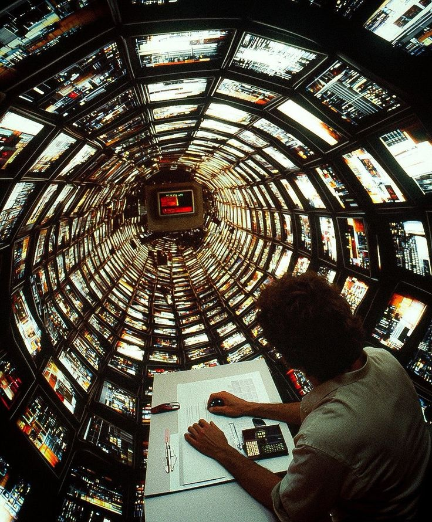

# WaWa News.

WaWa News is a modern, high-performance, and minimal blogging platform designed for the modern creator. Built with vanilla HTML, CSS, and JavaScript, it offers a premium glassmorphic user interface, cohesive green design system accents, and an interactive client-side reading experience.



## Features

- **Responsive Grid System**: Fluid 4-column layout on desktop viewports that seamlessly scales down to 2 columns on tablets and a single column on mobile screens.
- **Interactive Modal Reading Engine**: Click any article card to load its detailed layout dynamically inside an animated modal.
- **Local Storage Bookmark Shelf**: Save your favorite articles locally. The bookmarks manager tracks count badge states dynamically in the header navigation.
- **Real-Time Client-Side Search & Filters**: Instantly query articles by title or select categories to narrow down readings without page reloads.
- **Modern Glassmorphic Header & Subtle Glows**: Enjoy smooth transitions, blur-backdrop headers, and hover scaling on interactive cards.
- **Subscription & Contact Modals**: Integrated modals for subscribing to newsletters or sending messages, completely stylized and responsive.
- **Completely Self-Contained Assets**: Clean asset system sourcing images locally from the `images/` directory.

## Project Structure

```text
├── index.html          # Main homepage containing the hero and articles feed
├── articles.html       # Full archive listing all publications
├── about.html          # About page presenting WaWa News's values and mission
├── contact.html        # Clean, centered contact form page
├── css/
│   └── style.css       # Core design system tokens, typography, and styles
├── js/
│   └── script.js       # Dynamic routing, search filtering, and bookmark system
└── images/
    └── [1-7].jpg       # Local optimized high-resolution cover images
```

## Getting Started

Since WaWa News is built using pure frontend technologies (HTML, CSS, and JS), it requires no compile steps or dependency installations.

1. Clone or download the repository.
2. Open `index.html` directly in your browser, or run a local development server:
   ```bash
   # Using Python
   python -m http.server 8000

   # Or using Node.js (npx)
   npx serve .
   ```
3. Open `http://localhost:8000` (or the server's provided port) in your browser.

## Technologies Used

- **Markup**: Semantic HTML5 structures.
- **Styling**: Modern CSS3 (Variables, Flexbox, Grid, Media Queries, Backdrop-Filters).
- **Icons**: Lucide Icons library.
- **Fonts**: Plus Jakarta Sans.
- **Logic**: Vanilla ES6 JavaScript (LocalStorage APIs, DOM templates).
